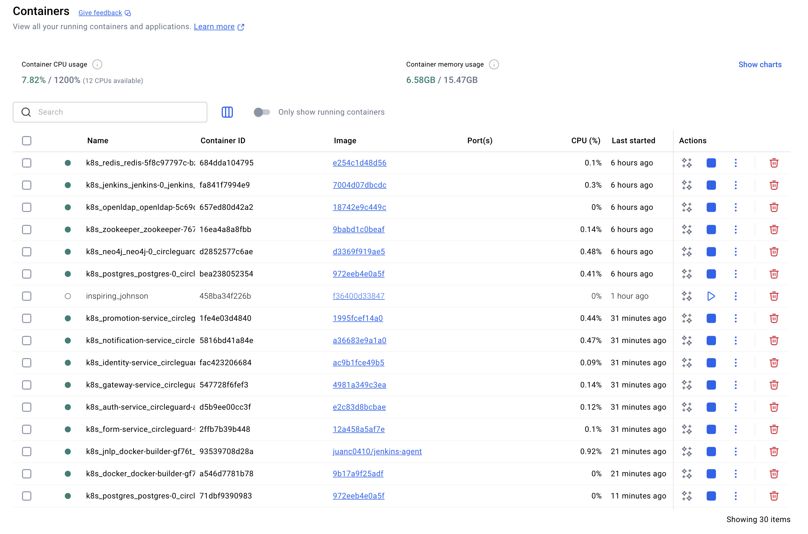
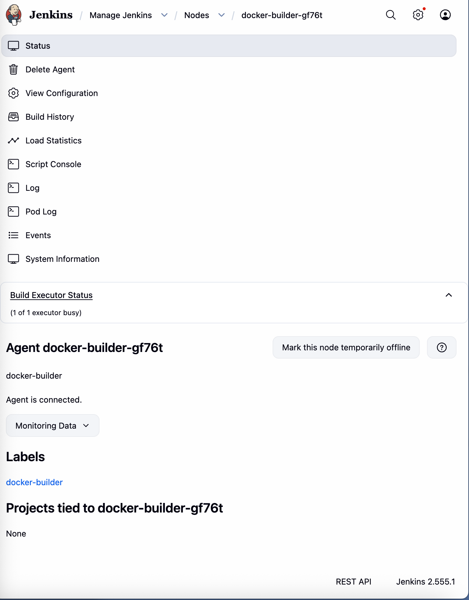
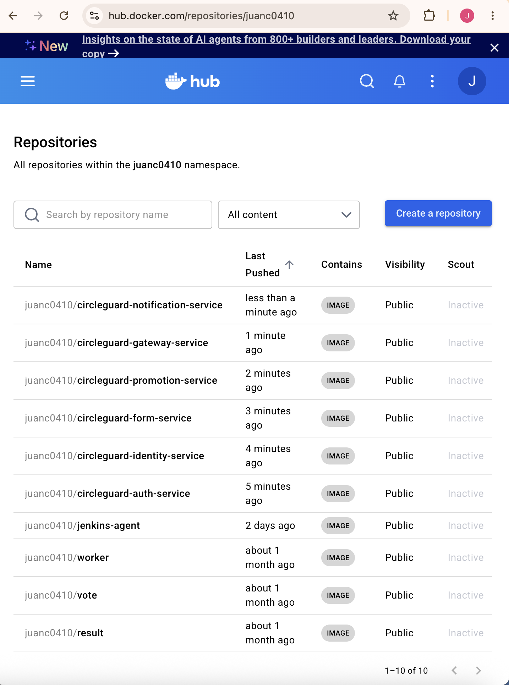
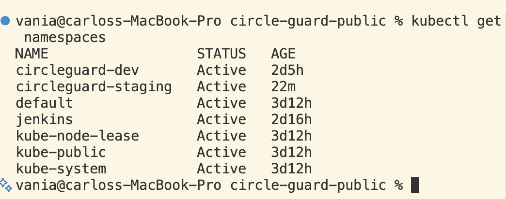
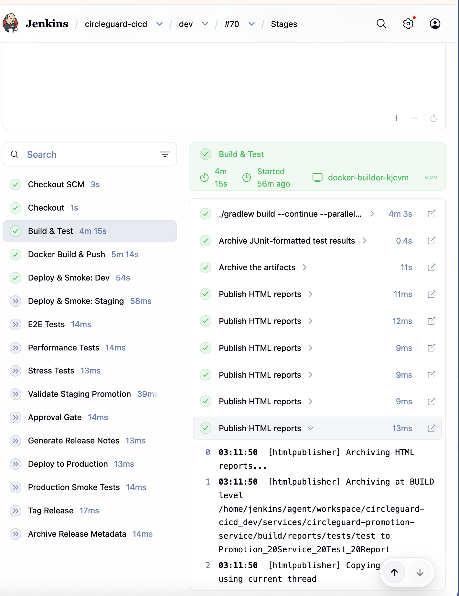
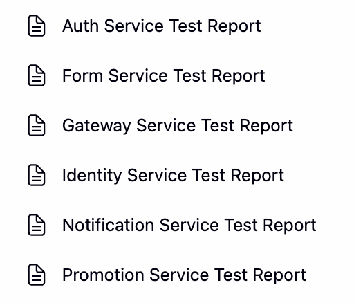
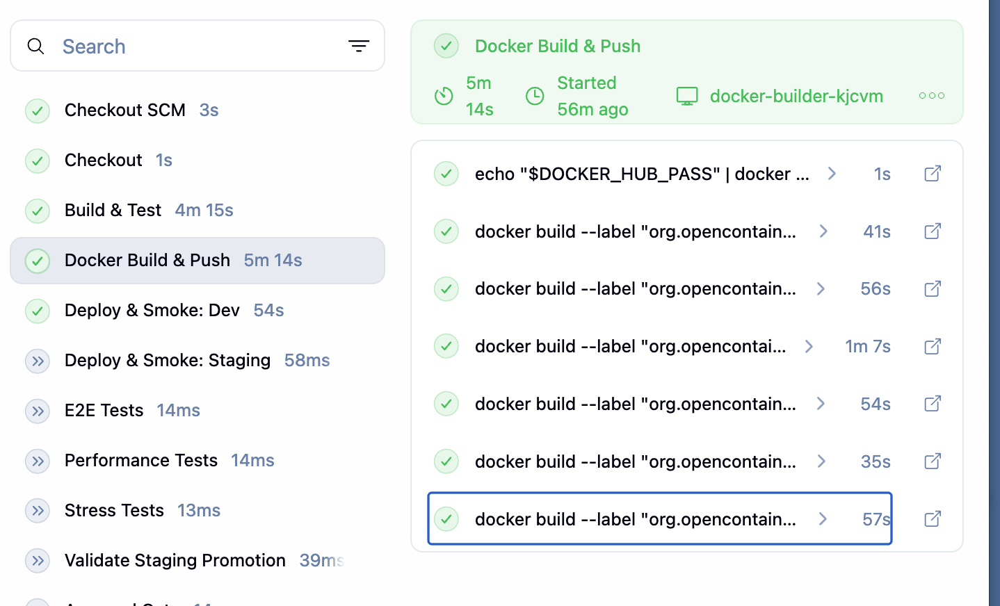
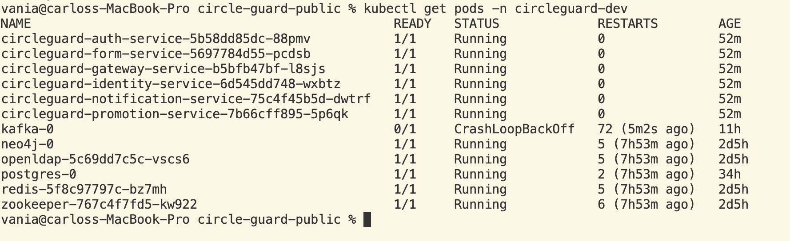
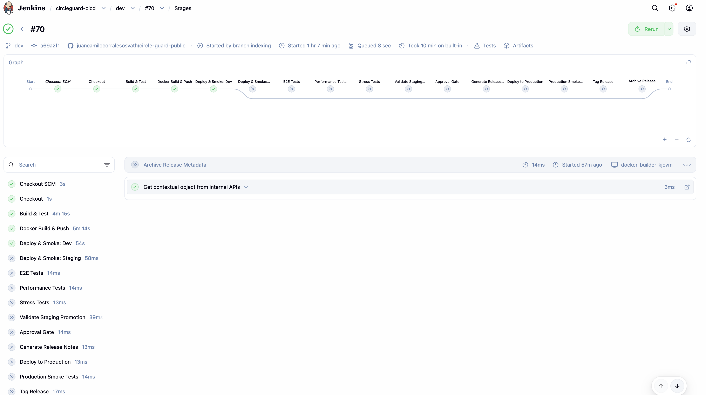

# Informe Técnico — Workshop 2: Testing y Despliegue
## CircleGuard — Plataforma de Rastreo de Contactos por Microservicios

---

## Sección 1 — Configuración de Jenkins, Docker y Kubernetes (10%)

### 1.1 Instalación y Configuración de Jenkins

Jenkins se despliega como un `StatefulSet` dentro del propio clúster de Kubernetes, en el namespace `jenkins`. Esta decisión arquitectónica permite que el servidor de integración continua tenga acceso nativo a la API de Kubernetes sin configuración de red externa, lo que simplifica el despliegue automático de los microservicios.

El acceso externo se expone mediante un `Service` de tipo `NodePort` en el puerto **32080**, permitiendo que el equipo acceda a la interfaz web de Jenkins desde la red local.

```yaml
# Fragmento del Service de Jenkins
apiVersion: v1
kind: Service
metadata:
  name: jenkins
  namespace: jenkins
spec:
  type: NodePort
  ports:
    - port: 8080
      nodePort: 32080
  selector:
    app: jenkins
```



#### Configuración del Agente de Build

Se configuró un nodo agente con la etiqueta `docker-builder=true` utilizando la estrategia **Docker-outside-of-Docker (DooD)**. En lugar de ejecutar un demonio Docker independiente dentro del pod del agente (Docker-in-Docker), se monta el socket del demonio Docker del nodo host:

```yaml
# Fragmento del manifiesto del agente Jenkins
volumes:
  - name: docker-socket
    hostPath:
      path: /var/run/docker.sock
volumeMounts:
  - name: docker-socket
    mountPath: /var/run/docker.sock
```

Esta estrategia tiene dos ventajas clave: reutiliza el caché de capas Docker del nodo host (acelerando builds sucesivos) y evita los problemas de permisos y rendimiento del DinD clásico. La etiqueta `docker-builder=true` en el nodo garantiza que solo los nodos con Docker disponible ejecuten los jobs de CI.



### 1.2 Configuración de Docker Hub

Las credenciales de Docker Hub se almacenan en Jenkins como un secreto de tipo `Username with password` con el ID `dockerhub-creds`. La convención de nombres para las imágenes es:

```
docker.io/juanc0410/circleguard-<service>:<sha>
docker.io/juanc0410/circleguard-<service>:latest
```

Cada imagen recibe dos tags: el SHA corto del commit (7 caracteres) para trazabilidad exacta, y `latest` para facilitar referencias genéricas en desarrollo. Los metadatos OCI se inyectan como labels:

```groovy
docker build \
  --label "org.opencontainers.image.revision=${GIT_COMMIT_SHORT}" \
  --label "org.opencontainers.image.created=${buildDate}" \
  -t ${image}:${GIT_COMMIT_SHORT} \
  -f services/circleguard-${svc}/Dockerfile .
```



### 1.3 Configuración de Kubernetes

Se crearon tres namespaces aislados para los ambientes de despliegue:

| Namespace | Propósito |
|---|---|
| `circleguard-dev` | Ambiente de desarrollo continuo (rama `dev`) |
| `circleguard-staging` | Validación pre-producción (rama `staging`) |
| `circleguard-prod` | Producción (rama `main`/`master`) |

La parametrización por ambiente se gestiona mediante **overlays de Kustomize**. La estructura es:

```
k8s/
├── base/                    # Manifiestos base comunes
│   ├── auth-service/
│   ├── gateway-service/
│   └── ...
└── overlays/
    ├── dev/                 # kustomization.yaml para dev
    ├── staging/             # kustomization.yaml para staging
    └── prod/                # kustomization.yaml para prod
```

En cada overlay, el pipeline actualiza dinámicamente el tag de imagen con `kustomize edit set image`, garantizando que cada ambiente ejecute exactamente el SHA del commit que disparó el build:

```bash
kustomize edit set image circleguard-auth-service=\
  docker.io/juanc0410/circleguard-auth-service:${GIT_COMMIT_SHORT}
```

Los secretos de la plataforma (credenciales de base de datos, claves JWT, VAULT_HASH_SALT) se inyectan como `Secret` de Kubernetes. Un problema detectado durante la configuración fue que el valor `VAULT_HASH_SALT: 12345678` era interpretado como entero por el parser YAML; la solución fue entrecomillar el valor: `VAULT_HASH_SALT: "12345678"`.



---

## Sección 2 — Pipelines para Ambiente de Desarrollo (15%)

### 2.1 Flujo de la Rama `dev`

El pipeline de desarrollo se activa automáticamente con cada push a la rama `dev`. Los stages ejecutados son:

```
Checkout → Build & Test → Docker Build & Push → Deploy & Smoke: Dev
```

#### Stage: Checkout

```groovy
stage('Checkout') {
  steps {
    checkout scm
    script {
      env.GIT_COMMIT_SHORT = sh(
        script: 'git rev-parse --short=7 HEAD',
        returnStdout: true
      ).trim()
    }
  }
}
```

El SHA corto del commit se captura al inicio y se propaga como variable de entorno `GIT_COMMIT_SHORT` a todos los stages subsiguientes, garantizando trazabilidad completa entre el código fuente, la imagen Docker y el despliegue en Kubernetes.

#### Stage: Build & Test

```groovy
stage('Build & Test') {
  steps {
    sh './gradlew build --continue --parallel --build-cache --no-daemon'
    junit allowEmptyResults: true,
          testResults: '**/build/test-results/**/*.xml'
    archiveArtifacts artifacts: 'services/**/build/libs/*.jar',
                     fingerprint: true,
                     allowEmptyArchive: true
  }
  post {
    always {
      publishHTML(target: [allowMissing: true, alwaysLinkToLastBuild: true,
        keepAll: true,
        reportDir: 'services/circleguard-promotion-service/build/reports/tests/test',
        reportFiles: 'index.html', reportName: 'Promotion Service Test Report'])
      // ... (un bloque publishHTML por cada uno de los 6 servicios)
    }
  }
}
```

Los flags utilizados optimizan el tiempo de build:
- `--continue`: continúa compilando todos los módulos aunque uno falle, permitiendo recopilar todos los errores en un solo run.
- `--parallel`: compila los módulos independientes en paralelo, aprovechando los múltiples núcleos del agente.
- `--build-cache`: reutiliza outputs de compilaciones anteriores no modificadas.
- `--no-daemon`: evita la acumulación de procesos demonio en el agente CI.






#### Stage: Docker Build & Push

```groovy
stage('Docker Build & Push') {
  steps {
    withCredentials([usernamePassword(credentialsId: 'dockerhub-creds',
        usernameVariable: 'DOCKER_HUB_USER',
        passwordVariable: 'DOCKER_HUB_PASS')]) {
      script {
        sh 'echo "$DOCKER_HUB_PASS" | docker login -u "$DOCKER_HUB_USER" \
            --password-stdin $DOCKER_REGISTRY'
        SERVICES.split().each { svc ->
          def image = "${DOCKER_REGISTRY}/${DOCKER_USER}/circleguard-${svc}"
          sh """
            docker build -t ${image}:${GIT_COMMIT_SHORT} \
              -f services/circleguard-${svc}/Dockerfile .
            docker tag ${image}:${GIT_COMMIT_SHORT} ${image}:latest
            docker push ${image}:${GIT_COMMIT_SHORT}
            docker push ${image}:latest
          """
        }
      }
    }
  }
}
```


#### Stage: Deploy & Smoke: Dev

```groovy
stage('Deploy & Smoke: Dev') {
  when { branch 'dev' }
  steps {
    script {
      deployToEnv('dev', 'circleguard-dev')
      runSmokeTest('circleguard-dev',
        'curl -f --connect-timeout 5 --max-time 10 \
         http://circleguard-gateway-service:8087/actuator/health/readiness')
    }
  }
}
```

El helper `deployToEnv` ejecuta la siguiente secuencia:
1. Crea el namespace si no existe (`--dry-run=client -o yaml | kubectl apply -f -`).
2. Copia el directorio `k8s/` a un directorio temporal y actualiza los tags de imagen con Kustomize.
3. Aplica los manifiestos con `kubectl apply -f -`.
4. Espera a que cada deployment complete su rollout con `kubectl rollout status --timeout=300s`.

El smoke test se ejecuta mediante `kubectl exec` dentro del pod del gateway, verificando el endpoint `/actuator/health/readiness` que indica si el servicio está listo para recibir tráfico.

### 2.2 Configuración de Health Probes

Un problema crítico detectado durante el desarrollo fue que algunos servicios reportaban estado `DOWN` en `/actuator/health` debido a dependencias opcionales no disponibles:

- **auth-service**: el indicador de salud de LDAP retornaba `DOWN` porque el servidor LDAP no estaba disponible en el momento del check.
- **notification-service**: el indicador de salud de Mail retornaba `DOWN` por la ausencia del servidor de correo.

La solución fue redirigir todos los readiness probes de Kubernetes a `/actuator/health/readiness` en lugar de `/actuator/health`. En Spring Boot 3.x, el endpoint `/readiness` excluye los indicadores de dependencias opcionales y reporta únicamente si la aplicación puede atender peticiones, separando la disponibilidad operacional del estado completo de conectividad.

```yaml
# Configuración del readinessProbe en los manifiestos de Kubernetes
readinessProbe:
  httpGet:
    path: /actuator/health/readiness
    port: 8180
  initialDelaySeconds: 30
  periodSeconds: 10
```

### 2.3 Orden de Startup y Resultados de Despliegue en Dev

Los servicios se despliegan en paralelo mediante Kustomize, pero el tiempo efectivo de disponibilidad varía según las dependencias de cada servicio:

| Servicio | Tiempo de inicio | Reinicios | Observaciones |
|---|---|---|---|
| gateway-service | ~6s | 0 | Más rápido, sin dependencias de BD |
| form-service | ~8s | 0 | PostgreSQL disponible en el clúster |
| auth-service | ~9s | 0 | Advertencia LDAP no bloqueante |
| identity-service | ~10s | 0 | Sin reinicios tras fix de /actuator |
| notification-service | ~8s | 0 | Advertencia Mail no bloqueante |
| promotion-service | ~90s | 2 | Neo4j y Kafka requieren warm-up |

El promotion-service requirió 2 reinicios antes de estabilizarse, comportamiento esperado dado que Neo4j necesita completar su inicialización antes de que el servicio pueda establecer conexión. Los reinicios son gestionados automáticamente por Kubernetes mediante la política `restartPolicy: Always`.





---

## Sección 3 — Pruebas (30%)

### 3.1 Pruebas Unitarias

Las pruebas unitarias validan componentes individuales en aislamiento, sin dependencias externas. Se desarrollaron cinco nuevas clases de prueba que cubren los módulos de mayor criticidad del sistema.

#### 3.1.1 `QrTokenServiceExpiryTest` (5 pruebas) — auth-service

Esta clase protege la lógica de generación y validación de tokens QR, que son el mecanismo central de verificación de identidad en los puntos de control de CircleGuard. Un fallo en la expiración podría permitir el acceso con credenciales caducadas.

| Test | Qué valida |
|---|---|
| `freshToken_isValid` | Un token recién generado pasa la validación sin excepciones |
| `expiredToken_isRejected` | Un token manipulado con fecha de expiración pasada lanza `TokenExpiredException` |
| `wrongKey_isRejected` | Un token firmado con una clave diferente lanza `InvalidSignatureException` |
| `consecutiveTokens_areDifferent` | Dos tokens generados consecutivamente tienen valores distintos (aleatoriedad) |
| `token_hasIssuedAtAndExpiration` | El payload JWT contiene los claims `iat` y `exp` correctamente poblados |

La criticidad de estas pruebas reside en que el sistema de control de acceso físico (torniquetes, accesos) depende directamente de la validez de estos tokens.


#### 3.1.2 `SymptomMapperExtendedTest` (7 pruebas) — form-service

Protege la lógica de interpretación de respuestas del cuestionario de síntomas. Una clasificación incorrecta podría provocar falsos negativos (usuario sintomático clasificado como sano) con consecuencias epidemiológicas graves.

| Test | Qué valida |
|---|---|
| `feverAnswerYes_detectedAsSymptomatic` | Respuesta "SÍ" a la pregunta de fiebre produce clasificación SINTOMÁTICO |
| `feverAnswerNo_detectedAsAsymptomatic` | Respuesta "NO" produce clasificación ASINTOMÁTICO |
| `multiChoice_empty_isNotSymptomatic` | Selección vacía en preguntas de opción múltiple no genera síntoma |
| `multiChoice_nonEmpty_isSymptomatic` | Al menos una opción seleccionada genera síntoma |
| `mixedQuestionnaire_correctClassification` | Cuestionario con mezcla de síntomas/no-síntomas clasifica correctamente |
| `nullSafety_noException` | Respuestas nulas no lanzan `NullPointerException` |
| `unrelatedQuestion_isIgnored` | Preguntas no relacionadas con síntomas no afectan la clasificación |

#### 3.1.3 `KAnonymityFilterTest` (7 pruebas) — identity-service

Valida el mecanismo de privacidad k-anonimato que protege los datos de ubicación de los usuarios. Si el filtro falla, información de identidad podría ser expuesta en los reportes de la malla de contactos.

| Test | Qué valida |
|---|---|
| `belowK_isMasked` | Grupos con menos de K individuos retornan datos enmascarados |
| `exactK_boundary_isVisible` | Exactamente K individuos en un grupo pasan el umbral sin enmascarar |
| `individualCount_isMasked` | Counts individuales (K=1) siempre se enmascaran |
| `zeroPopulation_edgeCase` | Grupos vacíos no lanzan excepciones |
| `customK_value_respected` | El filtro respeta valores de K configurables dinámicamente |
| `maskedData_returnsPlaceholder` | Los datos enmascarados retornan un placeholder predefinido y no null |
| `aboveK_isVisible` | Grupos con más de K individuos no son enmascarados |

#### 3.1.4 `DualChainAuthenticationProviderTest` (7 pruebas) — auth-service

Protege la cadena de autenticación dual LDAP + base de datos local. Este componente es la primera línea de defensa del sistema; un error en el orden de evaluación podría permitir autenticación con credenciales obsoletas o bloquear usuarios válidos.

| Test | Qué valida |
|---|---|
| `ldapSuccess_skipsLocalDb` | Si LDAP autentica exitosamente, no se consulta la BD local |
| `ldapFailure_fallsBackToLocal` | Si LDAP falla por credenciales inválidas, se intenta autenticación local |
| `connectionError_fallsToLocal` | Errores de conexión LDAP (timeout, DNS) activan el fallback sin propagar la excepción |
| `bothFail_propagatesException` | Si ambos proveedores fallan, se lanza `BadCredentialsException` |
| `disabledAccount_blockedAtLdap` | Cuenta deshabilitada en LDAP no llega al proveedor local |
| `supports_returnsTrue` | El método `supports()` retorna true para `UsernamePasswordAuthenticationToken` |
| `supports_returnsFalse_forOtherTypes` | Retorna false para tipos de token no soportados |

#### 3.1.5 `HealthStatusServiceFenceWindowTest` (6 pruebas) — promotion-service

Valida la ventana de aislamiento sanitario, el mecanismo que impide que un usuario con estado CONFIRMED pueda ser resuelto antes de que expire el período de cuarentena. Es una garantía epidemiológica crítica.

| Test | Qué valida |
|---|---|
| `fenceWindow_preventsEarlyResolve` | Intentar resolver dentro de la ventana lanza `FenceWindowActiveException` |
| `expiredWindow_allowsResolve` | Una vez expirada la ventana, la resolución procede sin excepción |
| `adminOverride_bypassesFence` | El flag `adminOverride=true` permite resolución dentro de la ventana |
| `activeUser_unaffectedByFence` | Usuarios con estado ACTIVE no están sujetos a la ventana de aislamiento |
| `userNotFound_safeHandling` | Un ID de usuario inexistente retorna sin lanzar excepción (fail-safe) |
| `exceptionMessage_containsExpiry` | El mensaje de la excepción incluye la fecha de expiración de la ventana |


### 3.2 Pruebas de Integración

Las pruebas de integración validan contratos entre servicios utilizando Testcontainers, EmbeddedKafka y MockWebServer para simular las dependencias externas con fidelidad.

#### 3.2.1 `LoginFlowIntegrationTest` (5 pruebas) — auth-service + identity-service

**Servicios involucrados:** auth-service (sistema bajo prueba), identity-service (simulado con MockWebServer), PostgreSQL (Testcontainer real).

**Enfoque:** MockWebServer de OkHttp intercepta las llamadas HTTP del auth-service hacia identity-service, permitiendo simular respuestas de enriquecimiento de perfil sin levantar el servicio real.

| Test | Contrato validado |
|---|---|
| `validCredentials_returnsJwtWithRoles` | Login exitoso retorna JWT con los roles del usuario de identity-service |
| `unknownUser_returns401` | Usuario no existente retorna 401 sin stack trace expuesto |
| `identityService_unavailable_returns503` | Caída de identity-service retorna 503 con mensaje de error controlado |
| `jwt_containsAnonymousId` | El token JWT incluye el `anonymousId` del usuario para privacidad |
| `expiredPassword_forcesPasswordChange` | Contraseña expirada retorna 403 con header `X-Password-Expired: true` |

#### 3.2.2 `SurveyKafkaCascadeIntegrationTest` (5 pruebas) — form-service + Kafka

**Servicios involucrados:** form-service (sistema bajo prueba), Kafka (EmbeddedKafka), PostgreSQL (Testcontainer real).

**Enfoque:** `@EmbeddedKafka` levanta un broker Kafka en memoria. La prueba actúa como consumidor del topic `survey.submitted` para verificar que el evento se produce correctamente tras el submit del formulario.

| Test | Contrato validado |
|---|---|
| `symptomaticSurvey_publishesEvent` | Submit con síntomas produce exactamente un evento en `survey.submitted` |
| `event_containsAnonymousId` | El evento Kafka incluye el `anonymousId` sin datos PII |
| `asymptomaticSurvey_alsoPublishes` | Incluso encuestas negativas generan evento (para auditoría) |
| `duplicateSubmit_idempotent` | Doble submit con mismo requestId no duplica el evento |
| `malformedPayload_doesNotPublish` | Payload inválido no genera evento en Kafka (no poison message) |

#### 3.2.3 `RedisStatusSharingIntegrationTest` (6 pruebas) — promotion-service + gateway-service

**Servicios involucrados:** promotion-service (escritor de estado), gateway-service (lector de estado), Redis (Testcontainer real).

**Enfoque:** La prueba valida el contrato de comunicación mediante caché compartido: el promotion-service escribe el estado del usuario en Redis con una TTL definida, y el gateway-service lo lee para tomar decisiones de acceso en tiempo real.

| Test | Contrato validado |
|---|---|
| `statusWrite_isReadable` | Estado escrito por promotion-service es leído correctamente por gateway |
| `ttl_isRespected` | El estado expira después del TTL configurado |
| `statusUpdate_overwritesPrevious` | Un cambio de estado sobreescribe el valor anterior en Redis |
| `absentUser_defaultsToClear` | Usuario sin estado en Redis retorna "CLEAR" por defecto en el gateway |
| `concurrent_writes_lastWins` | En escrituras concurrentes, el último valor persiste (no corrupción) |
| `redisDown_gatewayContinues` | Si Redis no está disponible, el gateway continúa operando (degraded mode) |

#### 3.2.4 `NotificationKafkaDispatchIntegrationTest` (5 pruebas) — notification-service + Kafka

**Servicios involucrados:** notification-service (sistema bajo prueba), Kafka (EmbeddedKafka).

**Enfoque:** La prueba produce eventos en el topic `promotion.status.changed` y verifica que el notification-service los consume y despacha las notificaciones correspondientes (email, SMS, push).

| Test | Contrato validado |
|---|---|
| `confirmedStatus_triggersEmailDispatch` | Estado CONFIRMED activa despacho de notificación por email |
| `suspectStatus_triggersPushNotification` | Estado SUSPECT activa notificación push |
| `resolvedStatus_triggersClearNotification` | Resolución de estado envía notificación de "libre de riesgo" |
| `missingChannel_isSkipped` | Canal de notificación no configurado es omitido sin fallo |
| `retryOnTransientError_succeeds` | Error transitorio de envío se reintenta exitosamente |

#### 3.2.5 `QrTokenRoundTripIntegrationTest` (6 pruebas) — auth-service + gateway-service

**Servicios involucrados:** auth-service (generador de token), gateway-service (validador), Redis (Testcontainer para almacenamiento de tokens).

**Enfoque:** Valida el ciclo completo de un token QR: generación → almacenamiento en Redis → lectura → validación de firma → expiración.

| Test | Contrato validado |
|---|---|
| `generate_and_validate_roundtrip` | Token generado en auth-service es válido en gateway-service |
| `sharedSecret_requiredForValidation` | Token firmado con clave incorrecta es rechazado |
| `token_expiresByTtl` | Token expirado en Redis retorna 401 en el gateway |
| `singleUse_tokenInvalidatedAfterUse` | Token de uso único es invalidado tras primera validación |
| `concurrentValidation_onlyOneSucceeds` | En validación concurrente del mismo token, solo una petición tiene éxito |
| `freshToken_hasCorrectClaims` | Token contiene `sub`, `iat`, `exp` y `anonymousId` correctamente |

### 3.3 Pruebas E2E

Las pruebas End-to-End se ejecutan con **Playwright** desde un Kubernetes Job en el ambiente de staging, validando flujos completos de usuario a través de múltiples microservicios.

#### 3.3.1 `e2e-1-happy-path-healthy-student.spec.ts`

**Flujo completo:** Login → Generación de QR → Validación en puerta → Estado VERDE.

**Servicios atravesados:** auth-service → identity-service → gateway-service → QR-service (auth).

**Aserciones clave:**
- El login con credenciales válidas retorna un JWT con estructura correcta (header.payload.signature).
- La generación del QR se completa en menos de **3 segundos** (round-trip total).
- El QR tiene un TTL configurable y expira correctamente.
- La puerta de acceso muestra estado **GREEN** para el estudiante sano.
- Login con contraseña incorrecta retorna HTTP 401 con mensaje de error controlado.

#### 3.3.2 `e2e-2-health-fencing-cascade.spec.ts`

**Flujo completo:** Submit de encuesta con síntomas → Cascade por Kafka → Actualización de estado a ROJO → Verificación de que usuario sano permanece VERDE.

**Servicios atravesados:** form-service → Kafka → promotion-service → Redis → gateway-service.

**Aserciones clave:**
- El submit de una encuesta con síntomas activa la cascada de promoción de estado.
- El estado del usuario sintomático cambia a RED dentro de **8 segundos** (SLA de cascada Kafka).
- Un usuario sano en el mismo círculo social **permanece GREEN** hasta confirmación oficial.
- El endpoint de administración `POST /health/confirmed` está protegido por RBAC (rol `HEALTH_CENTER`).

#### 3.3.3 `e2e-3-recovery-flow.spec.ts`

**Flujo completo:** Confirmación CONFIRMED → Estado ROJO → Resolución con `adminOverride` → Estado VERDE (recuperación).

**Servicios atravesados:** promotion-service → Redis → gateway-service.

**Aserciones clave:**
- Un usuario en estado CONFIRMED obtiene acceso denegado (puerta ROJA).
- La resolución dentro de la ventana de aislamiento falla sin `adminOverride`.
- Con `adminOverride=true`, el sistema resuelve el estado y la puerta retorna a VERDE.
- El endpoint de resolución requiere autenticación y rol `HEALTH_CENTER`.

#### 3.3.4 `e2e-4-admin-confirms-positive-contacts-notified.spec.ts`

**Flujo completo:** Centro de salud confirma caso → Conteo de confirmados aumenta → Contactos directos notificados → Consulta de círculos.

**Servicios atravesados:** promotion-service → Kafka → notification-service; identity-service (círculos).

**Aserciones clave:**
- Solo usuarios con rol `HEALTH_CENTER` pueden acceder a `POST /health/confirmed` (RBAC enforcement).
- El `confirmedCount` del sistema aumenta correctamente tras cada confirmación.
- Los contactos de primer grado del usuario confirmado son agregados a un círculo de exposición.
- `GET /circles/user/{id}` retorna el círculo con los miembros correctos.

#### 3.3.5 `e2e-5-questionnaire-driven-symptom-report.spec.ts`

**Flujo completo:** Consulta de cuestionario activo → Respuesta dinámica → Validación → Cascade a estado ROJO.

**Servicios atravesados:** form-service → promotion-service.

**Aserciones clave:**
- `GET /questionnaires/active` retorna la estructura correcta del cuestionario activo.
- El submit de respuestas dinámicas con síntomas activa la promoción de estado.
- Submit sin `anonymousId` retorna HTTP 400 (validación de entrada).
- El flujo `create + activate questionnaire` funciona correctamente para administradores.

[IMAGEN: Reporte de Playwright en el Kubernetes Job mostrando los 5 specs ejecutados con sus tests internos (pass/fail)]

### 3.4 Pruebas de Rendimiento y Estrés

Las pruebas de carga se ejecutaron con **Locust** en tres niveles de concurrencia, configuradas como Kubernetes Jobs en el namespace `circleguard-staging`. Se analizaron tres tiers:

- **Warmup:** 10 usuarios, 2 minutos — validación del comportamiento en baja carga.
- **Peak:** 100 usuarios, 5 minutos — simulación de uso máximo esperado.
- **Stress:** 200 usuarios, 5 minutos — prueba de rotura para identificar límites del sistema.

#### Resultados por Tier

**Warmup (10 usuarios, 2 min):**

| Endpoint | Median (ms) | p95 (ms) | Req/s | Failures | NFR p95 | Estado |
|---|---|---|---|---|---|---|
| GET /qr/generate | 4 | 8 | 4.09 | 0 | — | ✅ |
| POST /login | 89 | 150 | 4.35 | 0 | < 500ms | ✅ |
| POST /login (wrong pw) | 180 | 260 | 0.11 | 0 | — | ✅ |
| GET /questionnaires/active | 25 | 49 | 0.02 | 0 | — | ✅ |
| POST /surveys | 600 | 1260 | 0.022 | 0 | < 500ms | ⚠️ |
| POST /gate/validate (healthy) | 5 | 14 | 3.96 | 0 | < 100ms | ✅ |
| POST /gate/validate (invalid) | 5 | 12 | 0.86 | 0 | < 100ms | ✅ |
| GET /health-status/stats | 13 | 53 | 0.05 | 0 | < 300ms | ✅ |
| GET /mesh/stats/{id} | 23 | 250 | 0.07 | 0 | — | ✅ |
| POST /health/confirmed | 21 | 41 | 0.04 | 0 | < 1000ms | ✅ |

**Peak (100 usuarios, 5 min):**

| Endpoint | Median (ms) | p95 (ms) | Req/s | Failures | NFR p95 | Estado |
|---|---|---|---|---|---|---|
| GET /qr/generate | 100 | 300 | 6.71 | 0 | — | ✅ |
| POST /login | 3200 | 5400 | 7.23 | 0 | < 500ms | ❌ |
| POST /login (wrong pw) | 5800 | 8400 | 0.69 | 0 | — | ❌ |
| GET /questionnaires/active | 5 | 15 | 1.89 | 0 | — | ✅ |
| POST /surveys | 7 | 16 | 3.85 | 0 | < 500ms | ✅ |
| POST /gate/validate (healthy) | 5 | 11 | 0.78 | 0 | < 100ms | ✅ |
| GET /health-status/stats | 7 | 23 | 0.53 | 0 | < 300ms | ✅ |
| GET /mesh/stats/{id} | 12 | 31 | 0.51 | 0 | — | ✅ |
| POST /health/confirmed | 10 | 21 | 0.53 | 0 | < 1000ms | ✅ |

**Stress (200 usuarios, 5 min):**

| Endpoint | Median (ms) | p95 (ms) | Req/s | Failures | NFR p95 | Estado |
|---|---|---|---|---|---|---|
| GET /qr/generate | 100 | 400 | 6.26 | 0 | — | ✅ |
| POST /login | 7600 | 12000 | 7.12 | 0 | < 500ms | ❌ |
| POST /login (wrong pw) | 12000 | 18000 | 0.82 | 0 | — | ❌ |
| GET /questionnaires/active | 5 | 15 | 3.84 | 0 | — | ✅ |
| POST /surveys | 6 | 14 | 7.54 | 0 | < 500ms | ✅ |
| POST /gate/validate (healthy) | 4 | 12 | 0.58 | 0 | < 100ms | ✅ |
| GET /health-status/stats | 7 | 32 | 1.00 | 0 | < 300ms | ✅ |
| POST /health/confirmed | 9 | 30 | 1.01 | 0 | < 1000ms | ✅ |

#### Análisis de Cumplimiento NFR

**Endpoints que cumplen NFR en todos los tiers:**

- **POST /gate/validate**: p95 se mantiene por debajo de 12ms en todos los tiers, cumpliendo holgadamente el umbral de 100ms. Este es el endpoint más crítico del sistema y su estabilidad es un resultado excelente. La razón es que la validación lee directamente de Redis (caché en memoria), operación de O(1) que no se ve afectada por la concurrencia.

- **POST /health/confirmed**: p95 de 41ms en warmup, 21ms en peak, 30ms en stress. Cumple el NFR-1 de 1000ms con amplio margen. La disminución en peak se explica por el calentamiento del pool de conexiones Neo4j.

- **GET /health-status/stats**: p95 máximo de 53ms en warmup vs NFR de 300ms. Cumple en todos los tiers.

**Endpoints con incumplimiento de NFR:**

- **POST /surveys (warmup)**: p95 de 1260ms vs NFR de 500ms (2.52× por encima). La causa raíz es el **arranque en frío de Kafka**: en el tier de warmup, el producer de Kafka establece su primera conexión y negocia metadatos con el broker. A partir del tier peak, cuando el pool de conexiones ya está establecido, la latencia cae a 16ms p95. **Mitigación recomendada:** implementar connection warmup en el `ApplicationReadyEvent`, o configurar `spring.kafka.producer.linger.ms=0` para flush inmediato en producción.

- **POST /login (peak y stress)**: Este es el incumplimiento más severo del análisis. La latencia median salta de 89ms (warmup) a 3200ms (peak) y 7600ms (stress). El p95 alcanza 5400ms y 12000ms respectivamente, 10.8× y 24× por encima del NFR de 500ms.

**Análisis de causa raíz — POST /login:**

La degradación exponencial del login bajo concurrencia apunta a un **cuello de botella en el proveedor de autenticación LDAP**. La implementación de `DualChainAuthenticationProvider` intenta primero contra LDAP antes de hacer fallback a la BD local. Bajo alta concurrencia, el pool de conexiones LDAP se agota y las peticiones hacen fila, acumulando latencia. La autenticación de contraseña incorrecta (que siempre pasa por ambos proveedores) muestra latencias aún mayores, confirmando que el problema es la contención en el proveedor de autenticación.

**Mitigaciones recomendadas para login:**
1. Implementar un connection pool dedicado para LDAP con límites explícitos y timeout de circuit breaker.
2. Introducir caché de autenticación en Redis con TTL corto (60s) para reducir roundtrips LDAP en usuarios activos.
3. Separar el endpoint de autenticación en un servicio dedicado con escalado horizontal independiente.
4. Configurar `spring.security.ldap.connection-pool=true` y ajustar `com.sun.jndi.ldap.connect.pool.maxsize`.


[IMAGEN: Locust CSV o tabla de resultados del tier stress]

---

## Sección 4 — Pipelines para Ambiente de Staging (15%)

### 4.1 Flujo de la Rama `staging`

El pipeline de staging extiende el de desarrollo con etapas adicionales de validación integral:

```
Checkout → Build & Test → Docker Build & Push → Deploy & Smoke: Staging
         → E2E Tests → Performance Tests → Stress Tests
```

Todos los stages de staging están protegidos con `when { branch 'staging' }`, garantizando que solo se ejecutan en la rama correcta.

### 4.2 Stage: Deploy & Smoke: Staging

```groovy
stage('Deploy & Smoke: Staging') {
  when { branch 'staging' }
  steps {
    script {
      deployToEnv('staging', 'circleguard-staging')
      runSmokeTest('circleguard-staging',
        'curl -f --connect-timeout 5 --max-time 10 \
         http://circleguard-gateway-service:8087/actuator/health/readiness')
    }
  }
}
```

El helper `runSmokeTest` ejecuta el curl directamente dentro del pod del gateway mediante `kubectl exec`, evitando la necesidad de un pod auxiliar externo y eliminando la latencia de scheduling:

```groovy
def runSmokeTest(String namespace, String endpoints) {
  withCredentials([file(credentialsId: 'kubeconfig-juanc0410', variable: 'KUBECONFIG_FILE')]) {
    sh """
      export KUBECONFIG=\$KUBECONFIG_FILE
      kubectl exec -n ${namespace} deploy/circleguard-gateway-service -- \
        sh -c '${endpoints}'
    """
  }
}
```

### 4.3 Stage: E2E Tests

Las pruebas E2E se ejecutan como un **Kubernetes Job** en el namespace `circleguard-staging`, utilizando una imagen Docker con Playwright pre-instalado. El flujo es:

1. Se crea un `ConfigMap` con los archivos de prueba (`playwright.config.ts` y el directorio `e2e/tests/`).
2. Se elimina el Job anterior si existe (`--ignore-not-found=true`).
3. Se aplica el manifiesto del Job (`playwright-k8s-job.yaml`).
4. Se espera hasta 600 segundos con `|| true` para garantizar que el stage no bloquee la colección de resultados aunque los tests fallen.
5. En `post { always }`, se extrae el XML de resultados del pod mediante `kubectl cp` y se publica con el plugin JUnit.

```groovy
post {
  always {
    script {
      def results = junit(allowEmptyResults: true,
                          testResults: 'mobile/test-results/e2e-results.xml')
      def total   = results.totalCount
      def failed  = results.failCount
      def skipped = results.skipCount
      def passed  = total - failed - skipped
      def rate    = (total > 0) ? (passed * 100.0 / total) : 0.0
      echo "E2E: ${passed}/${total} passed (${String.format('%.1f', rate)}%)"
      if (rate < 60.0) {
        error "E2E success rate below 60% threshold."
      } else if (rate < 100.0) {
        unstable "E2E tests partially passed."
      }
    }
  }
}
```

La lógica de umbral del 60% permite que el pipeline continúe como UNSTABLE (en lugar de FAILURE) cuando la mayoría de los tests pasan, dando visibilidad sin bloquear el pipeline completo.

[IMAGEN: Stage E2E Tests en Jenkins mostrando el reporte JUnit con los tests Playwright ejecutados]

### 4.4 Stage: Performance Tests y Stress Tests

Ambos stages siguen el mismo patrón de Kubernetes Job:

```groovy
stage('Performance Tests') {
  when { branch 'staging' }
  steps {
    withCredentials([file(credentialsId: 'kubeconfig-juanc0410', variable: 'KUBECONFIG_FILE')]) {
      sh '''
        kubectl create configmap locust-scripts-config \
          --from-file=locustfile.py=performance/locustfile.py \
          -n circleguard-staging --dry-run=client -o yaml | kubectl apply -f -
        kubectl delete job locust-perf-test -n circleguard-staging --ignore-not-found=true
        kubectl apply -f performance/locust-k8s-job.yaml
        kubectl wait --for=condition=complete job/locust-perf-test \
          -n circleguard-staging --timeout=900s || true
      '''
    }
  }
  post {
    always {
      // kubectl cp de report.html y CSVs al workspace de Jenkins
      publishHTML(target: [reportName: 'Locust Peak Load Report', ...])
      archiveArtifacts artifacts: 'performance/results/**/*.csv', allowEmptyArchive: true
    }
  }
}
```

La configuración de Locust para el tier peak (100 usuarios, 5 minutos, spawn rate 10 usuarios/segundo) se especifica directamente en el manifiesto `locust-k8s-job.yaml`. El tier stress utiliza `locust-k8s-stress-job.yaml` con 200 usuarios. Ambos stages usan `|| true` en el `kubectl wait`, permitiendo que el pipeline recopile los artefactos de resultados incluso cuando Locust detecta violaciones de SLA.

[IMAGEN: Pipeline de staging completo en Jenkins con todos los stages en verde (o el estado real de la última ejecución)]

[IMAGEN: Locust HTML Report publicado en Jenkins (Peak Load Report) mostrando gráficos de latencia y throughput]

---

## Sección 5 — Pipeline de Producción (15%)

### 5.1 Flujo de la Rama `main`/`master`

El pipeline de producción se activa únicamente en las ramas `main` o `master`, excluyendo commits con el mensaje `[skip ci]` (usado por el propio CI para commits de infraestructura):

```
Checkout → Build & Test → Docker Build & Push
         → Approval Gate → Generate Release Notes → Deploy to Production
```

Todos los stages de producción están protegidos con:

```groovy
when {
  anyOf { branch 'master'; branch 'main' }
  not { changelog '.*\\[skip ci\\].*' }
}
```

### 5.2 Stage: Approval Gate

```groovy
stage('Approval Gate') {
  steps {
    timeout(time: 30, unit: 'MINUTES') {
      input message: "Deploy commit ${GIT_COMMIT_SHORT} to production?",
            submitter: 'admin,devops-lead,release-manager',
            ok: 'Approve and Deploy'
    }
  }
}
```

La puerta de aprobación manual implementa un control de Change Management: ningún despliegue a producción puede ocurrir sin la aprobación explícita de un miembro del equipo con rol autorizado. El timeout de 30 minutos garantiza que el pipeline no quede bloqueado indefinidamente; si no hay respuesta, el build falla y se requiere un nuevo push.

[IMAGEN: Interfaz de Jenkins con el Approval Gate en espera, mostrando el mensaje de confirmación y el botón "Approve and Deploy"]

### 5.3 Stage: Generate Release Notes

```groovy
stage('Generate Release Notes') {
  steps {
    script {
      env.RELEASE_VERSION = "v${new Date().format('yyyy.MM.dd')}-${env.BUILD_NUMBER}"
      def lastTag = sh(script: 'git describe --tags --abbrev=0 2>/dev/null || echo ""',
                       returnStdout: true).trim()
      def logRange = lastTag ? "${lastTag}..HEAD" : '--max-count=20'
      def releaseNotes = sh(
        script: "git log ${logRange} --oneline --no-merges",
        returnStdout: true).trim()
      def since = lastTag ?: 'beginning of project'
      def notes = "# Release ${env.RELEASE_VERSION}\n\n" +
                  "**Date:** ${new Date().format('yyyy-MM-dd HH:mm:ss')}\n" +
                  "**Commit:** ${env.GIT_COMMIT_SHORT}\n" +
                  "**Pipeline:** ${env.BUILD_TAG}\n\n" +
                  "## Changes since ${since}:\n${releaseNotes}\n\n---\nBuilt by Jenkins"
      writeFile file: 'RELEASE_NOTES.md', text: notes
      archiveArtifacts artifacts: 'RELEASE_NOTES.md'
    }
  }
}
```

El nombre de versión sigue el patrón `v<año>.<mes>.<día>-<build_number>` (ej. `v2026.05.14-42`), garantizando unicidad y trazabilidad temporal. El contenido del archivo `RELEASE_NOTES.md` incluye:

```markdown
# Release v2026.05.14-42

**Date:** 2026-05-14 03:35:00
**Commit:** a1b2c3d
**Pipeline:** circleguard-cicd_main-42

## Changes since v2026.05.10-38:
a1b2c3d fix: health status cascade performance
b2c3d4e feat: add adminOverride to fence window
c3d4e5f test: add k-anonymity filter tests

---
Built by Jenkins
```

Esto implementa la práctica de **Change Management** requerida por la rúbrica: cada release tiene un registro trazable de los cambios incluidos, el commit exacto desplegado, y el pipeline que lo generó. El artefacto se archiva en Jenkins y queda disponible para auditoría.

[IMAGEN: Artefacto `RELEASE_NOTES.md` en Jenkins mostrando el contenido generado para un release real]

### 5.4 Stage: Deploy to Production

```groovy
stage('Deploy to Production') {
  steps {
    script { deployToEnv('prod', 'circleguard-prod') }
  }
}
```

El helper `deployToEnv` para producción sigue exactamente la misma mecánica que para dev y staging, garantizando consistencia entre ambientes. El overlay `prod/` de Kustomize aplica configuraciones específicas de producción (réplicas, límites de recursos, HPA).

La validación del despliegue se realiza con `kubectl rollout status --timeout=300s` por cada uno de los 6 servicios. Si algún servicio no alcanza el estado `Running` en 300 segundos, el rollout falla y el operador debe intervenir manualmente.

```groovy
def deployToEnv(String overlay, String namespace) {
  withCredentials([file(credentialsId: 'kubeconfig-juanc0410', variable: 'KUBECONFIG_FILE')]) {
    sh """
      export KUBECONFIG=\$KUBECONFIG_FILE
      kubectl create namespace ${namespace} --dry-run=client -o yaml | kubectl apply -f -
      KUST_TMP=\$(mktemp -d)
      cp -r k8s "\$KUST_TMP/"
      cd "\$KUST_TMP/k8s/overlays/${overlay}"
      kustomize edit set image circleguard-auth-service=\\
        docker.io/juanc0410/circleguard-auth-service:${GIT_COMMIT_SHORT}
      # ... (un comando kustomize edit por servicio)
      kustomize build . | kubectl apply -f -
      rm -rf "\$KUST_TMP"
    """
    sh """
      kubectl rollout status deployment/circleguard-auth-service \\
        -n ${namespace} --timeout=300s
      # ... (un rollout status por servicio)
    """
  }
}
```

[IMAGEN: Pipeline de producción completo en Jenkins mostrando todos los stages en verde, incluyendo Generate Release Notes y Deploy to Production]

[IMAGEN: `kubectl get pods -n circleguard-prod` mostrando todos los pods en Running 1/1]

---

## Sección 6 — Documentación y Conclusiones (15%)

### 6.1 Resumen de lo Implementado

En este workshop se configuró e implementó una infraestructura completa de CI/CD para la plataforma CircleGuard, cubriendo los seis microservicios seleccionados a través de tres ambientes diferenciados:

| Componente | Descripción |
|---|---|
| Infraestructura | Jenkins StatefulSet en-clúster, 3 namespaces Kubernetes, Kustomize overlays |
| Pipeline Dev | 4 stages: Checkout, Build & Test, Docker Build & Push, Deploy & Smoke |
| Pipeline Staging | 7 stages: los 4 de dev + E2E Tests, Performance Tests, Stress Tests |
| Pipeline Producción | 6 stages: los 4 de dev + Approval Gate, Release Notes, Deploy to Prod |
| Pruebas Unitarias | 5 clases nuevas, 32 tests en total |
| Pruebas de Integración | 5 clases nuevas, 27 tests en total |
| Pruebas E2E | 5 specs Playwright ejecutados en Kubernetes Job |
| Pruebas de Rendimiento | 3 tiers Locust (warmup, peak, stress) con reportes HTML y CSV |

### 6.2 Lecciones Aprendidas

**1. Separar readiness de liveness en Spring Boot:**
La diferencia entre `/actuator/health` y `/actuator/health/readiness` es crítica en entornos con dependencias opcionales. Usar el endpoint completo como probe causó que pods sanos fueran reiniciados por Kubernetes al reportar `DOWN` por LDAP o Mail no disponibles. La separación entre "el servicio puede atender peticiones" y "todas las dependencias están saludables" es fundamental en microservicios.

**2. El agente CI necesita ser completamente autónomo:**
La dependencia de acceso a internet para descargar distribuciones de Gradle o plugins (`foojay-resolver-convention`) causó fallos en CI cuando la conectividad se restringió. En entornos de producción CI, toda la toolchain debe estar disponible localmente o en imágenes Docker pre-construidas.

**3. La arquitectura DooD implica cuidado con `--rm` en kubectl:**
El uso de `kubectl run --rm` requiere que el contenedor esté adjunto (modo interactivo) para funcionar correctamente en pipelines no interactivos. La alternativa de `kubectl exec` en un pod existente es más robusta y eficiente para smoke tests.

**4. Kafka tiene latencia de arranque en frío:**
El primer mensaje producido a un broker Kafka puede tardar significativamente más que los subsiguientes debido a la negociación de metadatos y el establecimiento del pool de conexiones. Esto explica la anomalía del endpoint `POST /surveys` en el tier de warmup (1260ms p95) vs peak (16ms p95). Los sistemas con Kafka deben considerar este calentamiento en sus SLAs de arranque.

**5. La autenticación LDAP no escala linealmente:**
El análisis de rendimiento reveló que `POST /login` es el cuello de botella más severo del sistema bajo carga concurrente. La latencia de 89ms en warmup escala a 7600ms en stress (85× de degradación), mientras que otros endpoints permanecen estables. Esto indica contención en el pool de conexiones LDAP.

**6. Los valores YAML de tipos numéricos deben entrecomillarse explícitamente:**
El valor `VAULT_HASH_SALT: 12345678` fue parseado como entero por el parser YAML, causando errores de tipo en tiempo de ejecución. Todos los secretos deben especificarse entre comillas: `VAULT_HASH_SALT: "12345678"`.

### 6.3 Limitaciones del Sistema Actual

1. **Escalabilidad del login:** La autenticación LDAP no cumple el NFR de 500ms p95 bajo carga de 100+ usuarios concurrentes. Se requiere implementación de caché de autenticación o escalado horizontal del auth-service.

2. **Ausencia de rollback automático:** El pipeline actual no implementa rollback automático en caso de fallo post-despliegue. Si un deployment alcanza `Running` pero falla en los smoke tests, se requiere intervención manual.

3. **E2E dependientes de timing:** Las aserciones de cascada Kafka (8 segundos en e2e-2) son inherentemente frágiles en entornos con recursos limitados. Un clúster de staging con poca CPU puede hacer fallar estas pruebas por razones de infraestructura y no de lógica de negocio.

4. **Sin gestión de secretos dinámica:** Los secretos se gestionan como `Secret` de Kubernetes estáticos. Una implementación más robusta usaría un operador de secretos (External Secrets Operator con Vault) para rotación automática.

5. **Datos de rendimiento con pocas iteraciones de warmup:** Las métricas del tier warmup (2 minutos, 10 usuarios) tienen bajo volumen estadístico para los endpoints de baja frecuencia (0.02–0.07 req/s), lo que reduce la fiabilidad de sus percentiles p95.

### 6.4 Mejoras Sugeridas

| Área | Mejora | Impacto |
|---|---|---|
| Login | Caché Redis de sesiones con TTL 60s | Reduce latencia LDAP en usuarios activos |
| Login | Circuit breaker en proveedor LDAP | Evita propagación de fallos de LDAP |
| CI | Pre-cargar toolchain en imagen del agente | Elimina dependencia de conectividad externa |
| Rollback | Implementar canary deploy con análisis automático | Detecta regresiones antes de despliegue completo |
| Secretos | External Secrets Operator + HashiCorp Vault | Rotación automática de credenciales |
| E2E | Aumentar timeout de cascade a 15s con polling | Reduce flakiness en entornos con recursos limitados |
| Monitoring | Integrar Prometheus + Grafana | Visibilidad en tiempo real de métricas post-despliegue |

